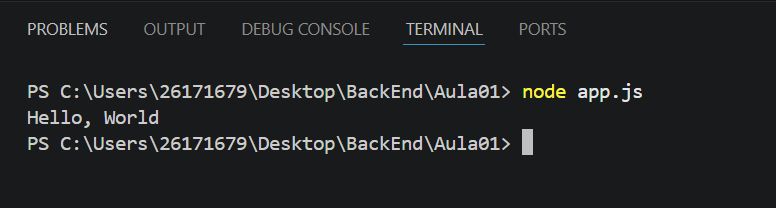

# Meu primeiro projeto JavaScript
## 😘Aluno

Nome: Sophia Campos 
Turma: DS1A
Professor: Vitor Lima

--- 

## Sobre 

Este projeto foi desenvolvido durante a primeira aula de JavaScript

O objetivo foi aprender: 
- ultlizar o VS Code;
- executar o JavaScript com Node.js
- ultizar o Terminal 
- criar documento utilizando Markdown 

--- 

## 🗂️ Estruturas 

```
MeuPrimeiroProjetoJavaScript
|
|-app.js
|-informacoes.js
|-operadores.js
|-variavel.js
|-readme.md
|-imagem/

```
## Como executar 

```bash
    node app.js
```
## Código

```javascript
    console.log("Olá, mundo");
```

## Resultado 



## Tecnologia 

- JavaScript 
- Node.js 
- Visual Studio Code 
- Markdown 

## O que aprendi 

- Como criar um arquivo JavaScript. 
- Como executar programas. 
- Utilizar o terminal. 
- Criar README. 
- Instalar extensões.
- Utilizar o Markdown. 
- GIT.
- Variável. 
- Operadores.